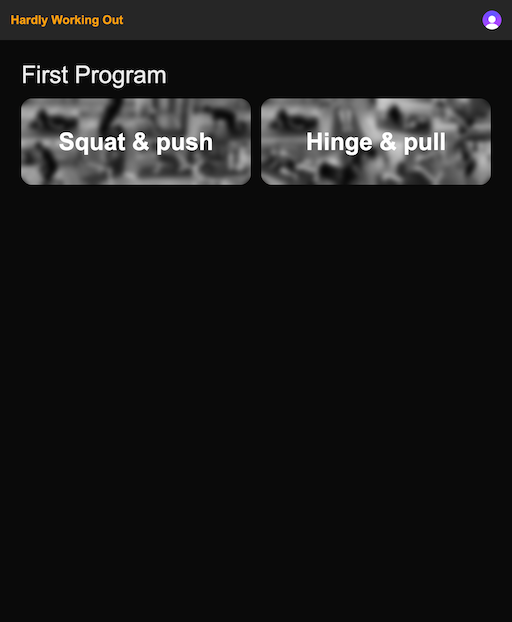

## workout-programming
Webapp to manage programming for workouts including the possibility to add exercise videos to the programming, notes and
having an overview of the exercises and different workouts.

### Features
#### Program overview


A list of programs, which can hold different workouts.

#### Workout overview

A list of workouts, which can hold different exercises. Each exercise shows the number of sets and reps, a video and the
possibility to add and adjust notes when necessary.

#### Exercise video integration

The exercise video is displayed as an overlay on top of the workout information when clicked on the preview image in the
previous view. Right now, these videos can be hosted on any platform which is supported by 
[react-player](https://www.npmjs.com/package/react-player).

## Development
### Prerequisites

This project expects Node.js version v20.17.0 or higher. Use e.g. ode Version Manager (NVM) to install and manage
Node.js versions. Find out more about NVM at https://github.com/nvm-sh/nvm.

Install the dependencies:

```bash
npm install
```

I use [husky](https://typicode.github.io/husky/) to manage git-hooks. It will get automatically installed as part of
the `npm install` command and creates a `.husky` folder in the project root in which you can add more git-hooks if
needed. Check out the husky documentation for more information.

### Development

```bash
npm run dev
# or
yarn dev
# or
pnpm dev
# or
bun dev
```

Open [http://localhost:3000](http://localhost:3000) with your browser to see the result.

## Deployment
Right now, this project is deployed to Vercel automatically via a hook in vercel which runs the `build` command whenever
there is a change in this repository. Since this is a nextjs project, it can be hosted anywhere where else as long as
nodejs environment is available.
